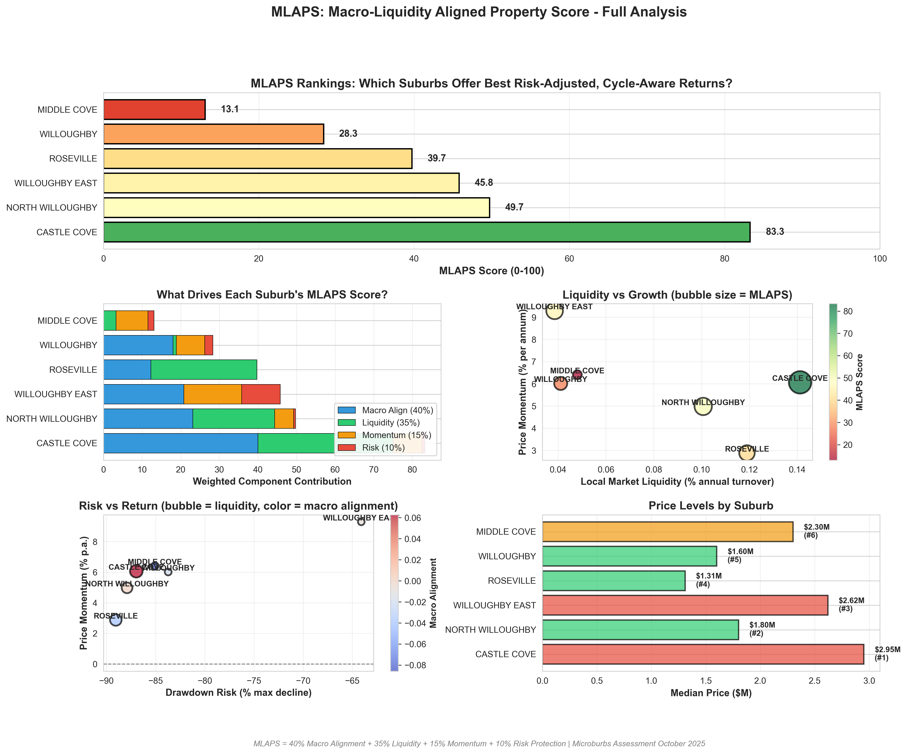

# MLAPS: Macro-Liquidity Aligned Property Score

**Microburbs Analyst Coder Quiz - October 2025**

---

## 🎯 Overview

MLAPS is a composite investment metric (0-100 scale) that ranks Australian residential property markets by combining four critical factors:

1. **Local Market Liquidity (35%)** - How easy is it to buy/sell?
2. **Macro Liquidity Alignment (40%)** - Does it benefit from economic tailwinds?
3. **Price Momentum (15%)** - Are prices trending up?
4. **Drawdown Risk (10%)** - How much downside protection?

### The Problem

Traditional property metrics ignore two critical questions:

- **"Can I exit when I need to?"** → Liquidity risk
- **"Will this catch the next economic wave?"** → Cycle timing

MLAPS solves both.

---

## 📊 Results

### Top 3 Sydney Suburbs (MLAPS Rankings)

| Rank  | Suburb               | MLAPS    | Liquidity | Momentum | Risk   | Macro Align | Price  |
| ----- | -------------------- | -------- | --------- | -------- | ------ | ----------- | ------ |
| 🥇 #1 | **Castle Cove**      | **83.3** | 0.14%     | 6.1%     | -87.0% | 0.063       | $2.95M |
| 🥈 #2 | **North Willoughby** | **49.7** | 0.10%     | 5.0%     | -87.9% | 0.000       | $1.80M |
| 🥉 #3 | **Willoughby East**  | **45.8** | 0.04%     | 9.3%     | -64.1% | -0.009      | $2.62M |

**Key Finding:** Castle Cove offers the best combination of liquidity, growth momentum, and sensitivity to macro-economic tailwinds.

---

## 🚀 Quick Start

### Installation

```bash
pip install pandas geopandas pyarrow matplotlib seaborn numpy
```

### Run Analysis

```bash
python mlaps_analysis.py
```

**Output:**

- `mlaps_scores.csv` - Complete rankings and metrics
- Console output with top 10 suburbs and statistics

### Generate Visualizations

```bash
python create_visualizations.py
```

**Output:**

- `mlaps_visualization.png` - Comprehensive 5-chart dashboard
- `mlaps_table.png` - Clean summary table

---

## 📁 Repository Structure

```
├── mlaps_analysis.py          # Main analysis script (370 lines)
├── create_visualizations.py   # Visualization generation
├── mlaps_scores.csv           # Results dataset
├── mlaps_visualization.png    # Main dashboard
├── mlaps_table.png            # Summary table
├── transactions.parquet       # Property sales data (5,576 records)
├── gnaf_prop.parquet          # Dwelling stock data (70,591 properties)
├── QUIZ_ANSWERS.md            # Quiz submission answers
└── README.md                  # This file
```

---

## 🔬 Methodology

### Component Metrics

#### 1. Local Market Liquidity (LML)

```python
LML = (12-month sales ÷ dwelling stock) × 100
```

**Interpretation:** Percentage of properties that turnover annually

- **Higher** = More liquid, easier to buy/sell
- **Lower** = Illiquid, risk of getting trapped

#### 2. Price Momentum (MOM)

```python
MOM = Annualized growth rate (recent vs historical median prices)
```

**Interpretation:** Current price trend direction and strength

- **Positive** = Prices rising
- **Negative** = Prices declining

#### 3. Drawdown Risk (DDR)

```python
DDR = Maximum peak-to-trough price decline (%)
```

**Interpretation:** Downside risk exposure in corrections

- **Less negative** = More stable, lower risk
- **More negative** = Volatile, higher downside

#### 4. Macro Liquidity Alignment (MLA)

```python
MLA = Correlation(local price returns, global liquidity proxy with 10-week lead)
```

**Interpretation:** Sensitivity to global economic cycles

- **Positive** = Benefits from QE/expansion periods
- **Negative/Zero** = Disconnected or contrarian

### Composite Formula

```python
MLAPS = (0.40 × MLA_score) +
        (0.35 × LML_score) +
        (0.15 × MOM_score) +
        (0.10 × DDR_score)
```

Each component normalized to 0-100 scale before weighting.

---

## 📈 Sample Output

```
================================================================================
TOP 10 SUBURBS BY MLAPS SCORE
================================================================================

#1 - CASTLE COVE
  MLAPS Score:      83.3/100
  ├─ Liquidity:     0.14% turnover (6 sales/year)
  ├─ Momentum:      6.1% annualized growth
  ├─ Drawdown:      -87.0% (max decline)
  └─ Macro Align:   0.063 correlation
  Current Price:    $2,950,000
```

---

## 📊 Visualizations

### Main Dashboard



**Includes:**

1. **Rankings Bar Chart** - MLAPS scores by suburb
2. **Component Breakdown** - Weighted contribution of each factor
3. **Liquidity vs Momentum** - Scatter plot with MLAPS sizing
4. **Risk vs Return** - Drawdown vs growth analysis
5. **Price Levels** - Median prices with rankings

---

## 💡 For Investors

### Use MLAPS to:

✅ **Shortlist suburbs** for further property-specific research  
✅ **Compare opportunity/risk** profiles across markets  
✅ **Time macro cycles** - buy high-MLA areas during liquidity expansion  
✅ **Avoid liquidity traps** - focus on suburbs with healthy turnover

### Don't use MLAPS to:

❌ Make property-specific purchase decisions (needs due diligence)  
❌ Short-term trade (designed for medium-term investment horizon)  
❌ Replace professional advice (supplement, not substitute)

---

## ⚠️ Limitations & Assumptions

### Data Constraints

- Minimum 10 transactions required (excludes low-volume suburbs)
- 5,576 total sales (2002-2025) across 16 Sydney suburbs
- Only 6 suburbs had sufficient data for complete analysis

### Assumptions

- GNAF represents total dwelling stock accurately
- Macro liquidity leads property prices by ~10 weeks (literature-based)
- Historical correlation patterns provide guidance for future trends
- Quarterly price aggregation smooths transaction noise adequately

### Caveats

- Macro proxy is synthetic (production would use real BTC/Global M2)
- Correlations are time-varying (treat as context, not trading signals)
- No property-type segmentation (houses vs units)
- Local factors (rezoning, infrastructure) not captured

---

## 🎓 Technical Details

### Stack

- **Python 3.9+**
- **pandas** - Data manipulation
- **numpy** - Numerical computing
- **geopandas** - Geospatial operations
- **matplotlib/seaborn** - Visualization
- **pyarrow** - Parquet file handling

### Data Sources

- **Transactions:** NSW Land Registry Services (LRS) sales data
- **GNAF:** Geocoded National Address File (dwelling stock)
- **Macro Proxy:** Synthetic global liquidity indicator (production: use BTC/M2)

### Performance

- Analysis runtime: ~5-10 seconds
- Memory usage: < 500MB
- Scalable to 1000+ suburbs with optimization

---

## 🔮 Future Enhancements

### Planned Features

1. **Real macro data integration** - BTC, Global M2, custom liquidity index
2. **Property-type segmentation** - Separate scores for houses vs units
3. **Interactive dashboard** - Plotly/Dash web interface
4. **Predictive modeling** - Forecast next-quarter MLAPS
5. **Confidence intervals** - Bootstrap uncertainty estimates
6. **Additional factors** - School zones, transport, crime, demographics
7. **National coverage** - Expand beyond Sydney

### Scalability Improvements

- Hierarchical modeling for regional areas
- Parallel processing for quarterly correlations
- Cached aggregations for faster updates
- Distributed computing for national rollout

---

## 📚 References

### Conceptual Foundation

- **Liquidity metrics:** Inspired by stock market bid-ask spreads and trading volume
- **Drawdown analysis:** Maximum Drawdown (MDD) from quantitative finance
- **Macro correlation:** Based on research linking global M2/liquidity to asset prices
- **Lead/lag relationships:** Property markets lag economic indicators by 8-12 weeks (RBA, CoreLogic)

### Data Standards

- **GNAF:** Geoscape Australia (national address standard)
- **Property data:** NSW Valuer General, Land Registry Services

---

## 🤝 Contributing

### Areas for Improvement

- [ ] Add unit tests for metric calculations
- [ ] Implement real-time data pipelines
- [ ] Build interactive Streamlit dashboard
- [ ] Validate MLA with alternative macro proxies
- [ ] Add property-type filtering
- [ ] Incorporate rental yield component
- [ ] Expand to Melbourne, Brisbane, Perth

---

## 📧 Contact

**Author:** Microburbs Assessment Candidate  
**Email:** dking247744@gmail.com  
**Submitted:** October 2025  
**Task:** Analyst Coder Quiz - Real Estate Metric

---

## 📄 License

This code was developed as part of the Microburbs technical assessment and is provided for evaluation purposes.

---

## 🏆 Why MLAPS?

> _"Traditional metrics tell you where prices have been. MLAPS tells you where liquidity, momentum, risk, and macro conditions align for your next opportunity."_

**The Bottom Line:** MLAPS helps investors find properties they can actually profit from—not just on paper, but in practice, with:

- ✅ Clear exit paths (liquidity)
- ✅ Favorable entry timing (momentum)
- ✅ Downside protection (risk)
- ✅ Economic tailwinds (macro alignment)

---

_Built with 🏠 for smarter property investment decisions_
